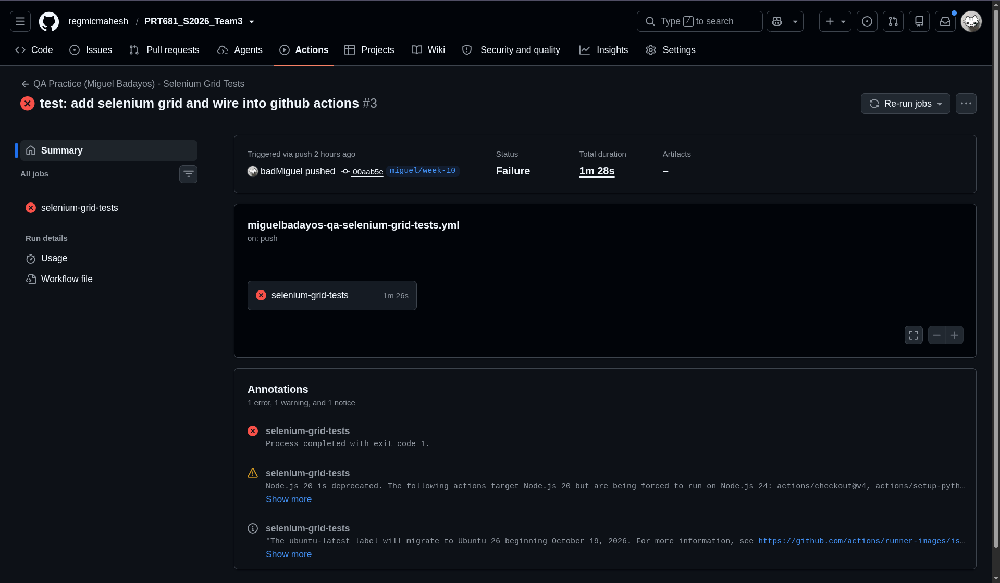
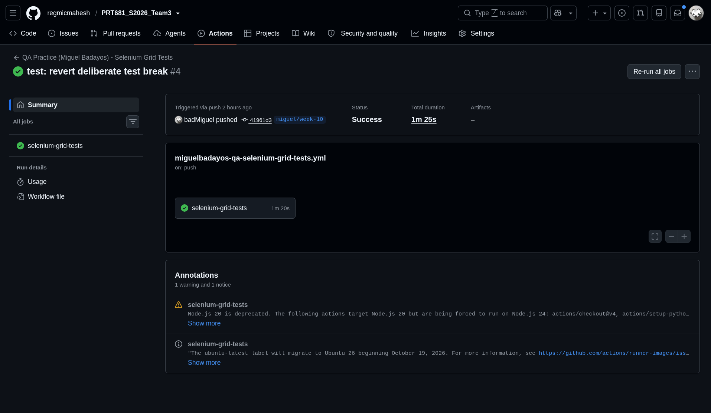

# how this was done

Self-contained, like the other weeks' tool folders — `qa-tests/` here is Week 10's own copy (Grid-only fixture, parametrised `["chrome", "firefox"]`), separate from Week 8's `qa-tests/` (single local headless Chrome, untouched). Two independent test suites, two independent CI workflows.

## run it locally

```bash
cd qa-tests
docker compose -f docker-compose.grid.yml up -d
curl http://localhost:4444/status   # look for "ready": true

pytest test_login.py -v
# each test should appear twice: test_valid_login[chrome], test_valid_login[firefox], etc.

docker compose -f docker-compose.grid.yml down
```

## CI

`.github/workflows/miguelbadayos-qa-selenium-grid-tests.yml` — separate from Week 8's workflow, both visible in Actions history. Starts the Grid, waits for it to report ready, runs the suite, tears the Grid down with `if: always()`.

## proving it fails on regression

Not new gating logic — pytest's non-zero exit code already fails the CI step. The actual practice task is demonstrating that, with real before/after evidence:

1. Broke `test_valid_login`'s assertion, pushed, confirmed the Grid workflow went red.
2. Reverted, pushed again, confirmed it went back to green.

## results

Local run confirmed 10 passed (5 test cases × 2 browsers) before any of this was pushed.



