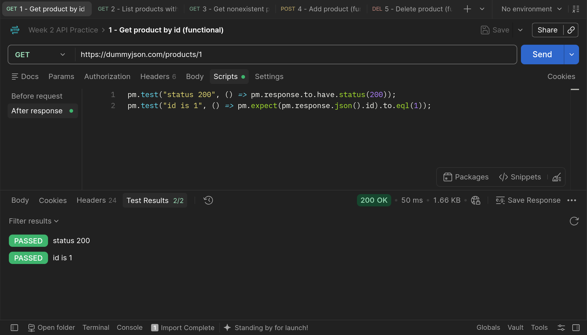
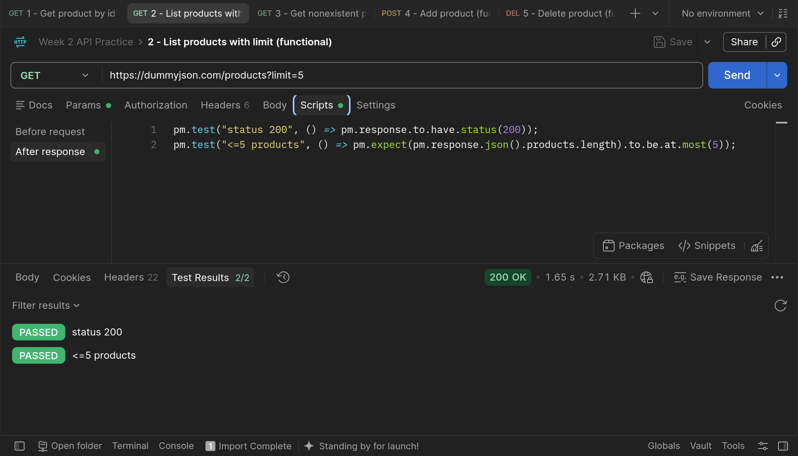
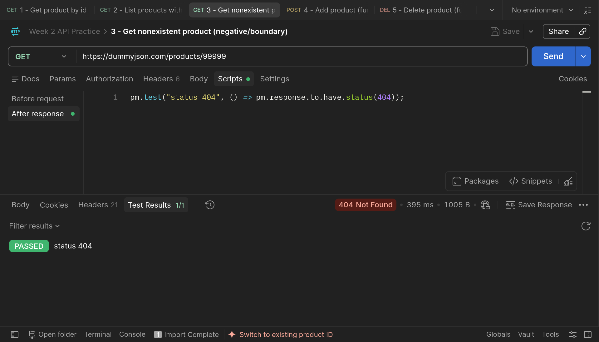
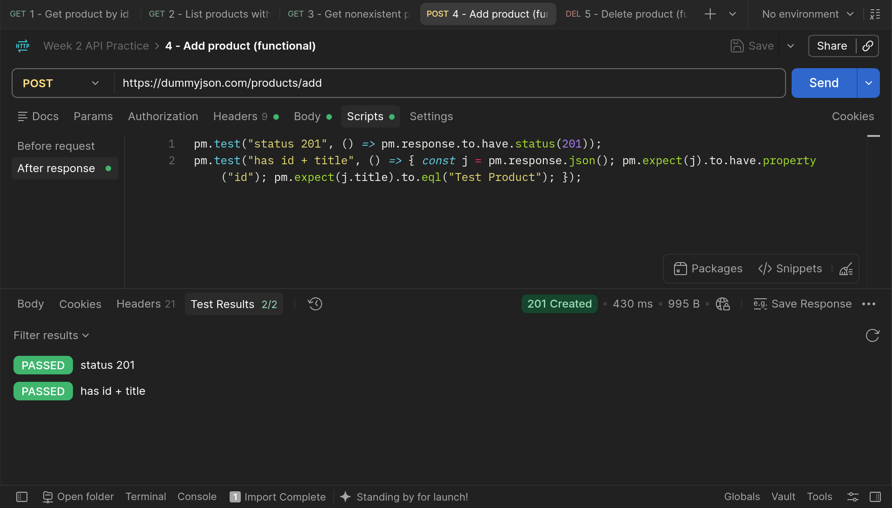
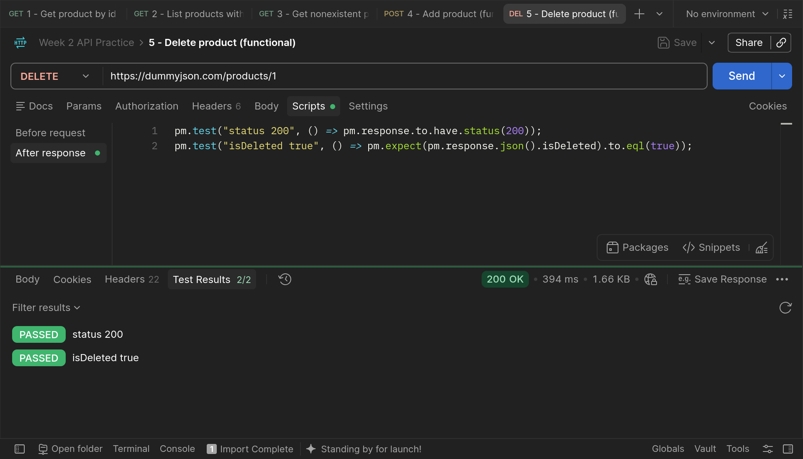

# how to run the test

1. open Postman
2. Import → select `test_api.json` (loads all 5 requests with their test scripts already attached)
3. Click into each request and hit **Send**
4. Confirm the green checkmarks under the **Test Results** tab

## results of test

**1 - Get product by id (functional)**

**2 - List products with limit (functional)**

**3 - Get nonexistent product (negative/boundary)**

**4 - Add product (functional)**

**5 - Delete product (functional)**

