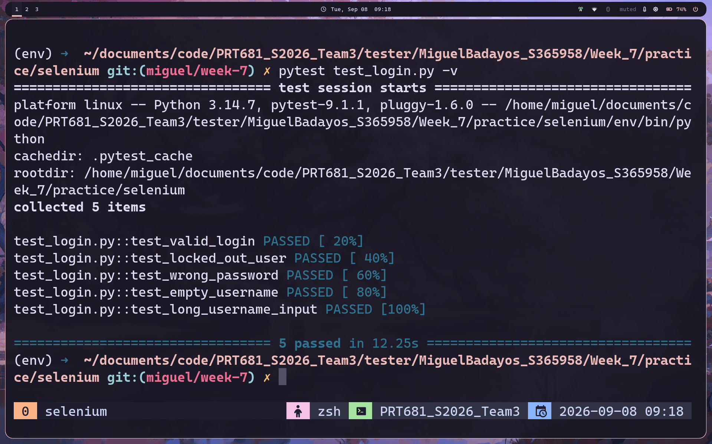

# how to run the test

1. create virtual environment with python and activate

```bash
virtualenv env

# activation might differ per OS
source ./env/bin/activate
```

2. install requirements

```bash
pip install -r requirements.txt
```

3. run the test

```bash
pytest test_login.py -v
```

## results of test


