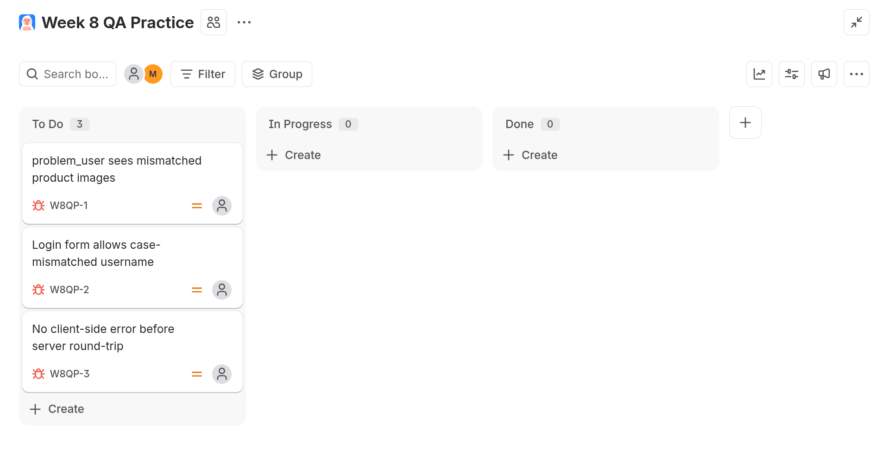

# how this was done

1. Created a free personal Jira site at id.atlassian.com/signup
2. Created a **Kanban** project named `Week 8 QA Practice`
3. Added a custom **Severity** field (Low / Medium / High / Critical) — Priority already exists by default
4. Migrated the 3 bugs originally logged in the Week 6 Trello board (`BUG-01`, `BUG-02`, `BUG-03`) into Jira as **Bug** issues, each set with Priority, Severity, and Status, and referencing its related test case ID in the description

## bugs migrated

| Bug | Jira Key | Title | Related Test Case | Severity | Priority | Status |
|---|---|---|---|---|---|---|
| BUG-01 | W8QP-1 | `problem_user` sees mismatched product images | exploratory, post-login | Medium | Medium | To Do |
| BUG-02 | W8QP-2 | Login form allows case-mismatched username | TC12 | Low–Medium | Low | To Do |
| BUG-03 | W8QP-3 | No client-side error before server round-trip | TC08 | Low | Low | To Do |

## results

