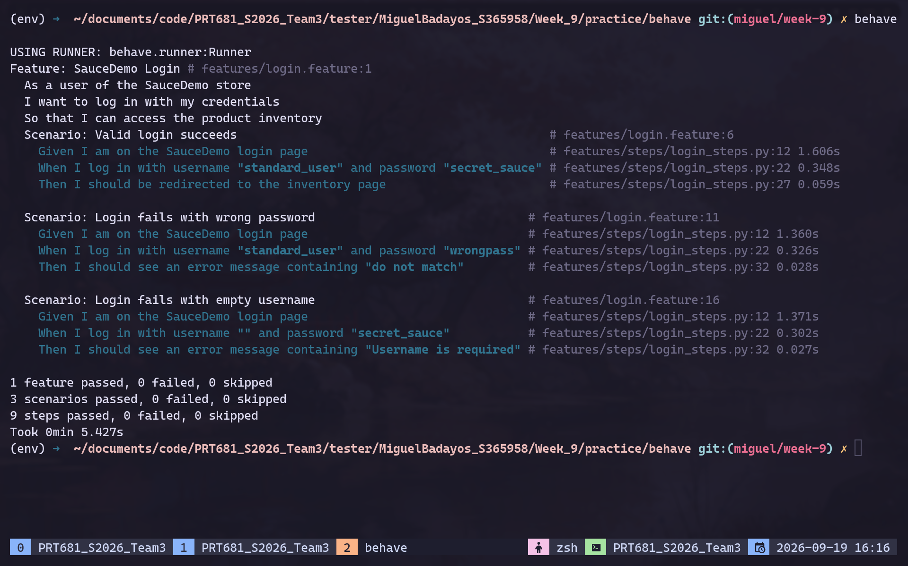

# how to run the test

1. create virtual environment with python and activate

```bash
python3 -m venv env

# activation might differ per OS
source ./env/bin/activate
```

2. install requirements

```bash
pip install -r requirements.txt
```

3. run the BDD suite

```bash
behave
```

> **Why behave instead of Cucumber?** Cucumber is native to Java/Ruby/JS and has no maintained Python binding. `behave` is the standard Python BDD runner and reads the exact same Gherkin `.feature` syntax — since the existing automation suite (Selenium, pytest, CI) is Python, behave is the direct equivalent rather than a substitute. See `../jmeter-and-bdd-notes.md` (Part 2 §3) for the comparison.

## structure

- `pages/login_page.py` — Page Object wrapping the SauceDemo login page's Selenium interactions
- `features/login.feature` — 3 Gherkin scenarios (same cases already covered by `Week_8/practice/qa-tests/test_login.py`, described in plain language)
- `features/steps/login_steps.py` — step definitions connecting Gherkin to the Page Object
- `features/environment.py` — driver cleanup hook

Note: the empty-username scenario needed the regex step matcher (`use_step_matcher("re")`) instead of behave's default `parse` matcher, which can't match an empty string inside `"{username}"`.

## results


