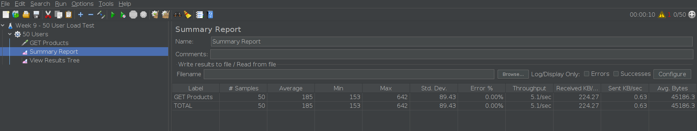

# how to run the test

1. Install JMeter (jmeter.apache.org) and make sure Java is available
2. Open `load-test.jmx` via JMeter → File → Open
3. Click the green ▶ (Start) button
4. Read the results in the **Summary Report** and **View Results Tree** listeners

## findings

Run against the live `dummyjson.com/products` endpoint:

| Metric                | Result           |
| --------------------- | ---------------- |
| # Samples             | 50               |
| Average response time | 185 ms           |
| Min / Max             | 153 ms / 642 ms  |
| Error %               | 0.00%            |
| Throughput            | 5.1 requests/sec |

- Error rate was 0% — the endpoint handled all 50 concurrent virtual users without failure.
- The gap between Min (153ms) and Max (642ms) shows some inconsistency under load — most requests landed close to the 153-185ms average, but at least one request during ramp-up took noticeably longer (~4x the minimum), worth watching if concurrency were pushed higher.
- At only 50 users, nothing suggests the endpoint is close to its limit — throughput held steady and errors stayed at 0%, so a next step to probe further would be scaling to 200-500 users to see whether latency degrades or errors start appearing.

## results

