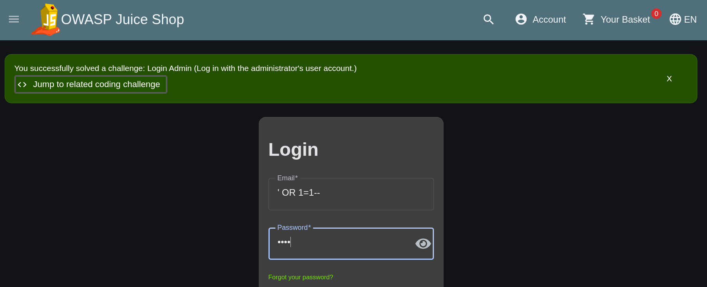
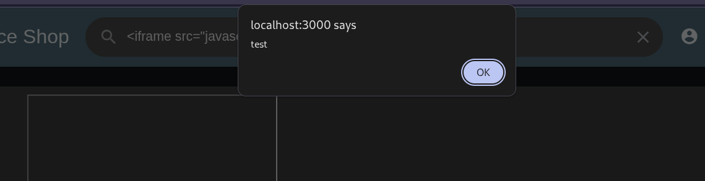
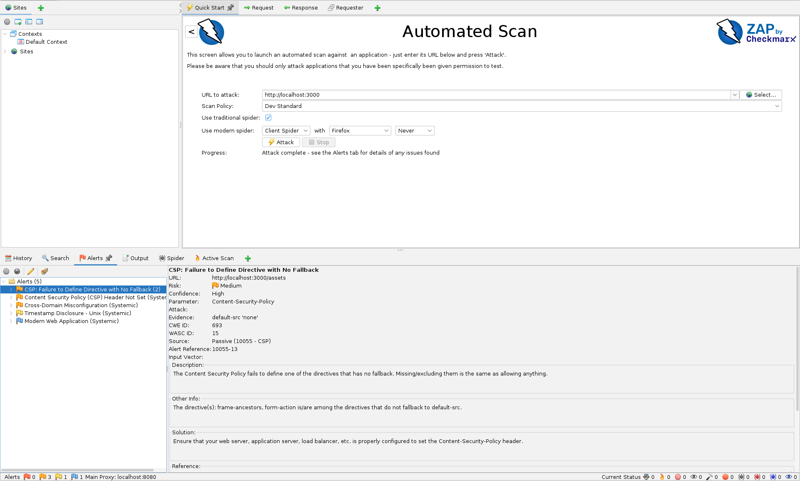

# OWASP Juice Shop — security testing practice

Source cloned for reference at `~/documents/code/juice-shop` (kept out of this repo — it's a third-party target app, not a deliverable). This folder holds the script to run it plus the findings from testing against it.

## run it

```bash
docker compose up -d
```

Then open http://localhost:3000. Runs the official `bkimminich/juice-shop` image — same one everyone testing against Juice Shop uses.

## stop it

```bash
docker compose down
```

## findings

### 1. SQL injection — authentication bypass on login (manual)

- **Steps to Reproduce:** Go to the login page. Enter `' OR 1=1--` as the email, any password. Click Login.
- **Expected Result:** Login rejected — invalid email format / no matching user.
- **Actual Result:** Logged in successfully, bypassing authentication (confirmed by Juice Shop's own "Login Admin" challenge banner).
- **Severity:** Critical (authentication bypass)
- **Priority:** Highest



### 2. Reflected XSS in search bar (manual)

- **Steps to Reproduce:** Go to the product search bar. Enter `<iframe src="javascript:alert('test')">`. Submit the search.
- **Expected Result:** Input is escaped/sanitized and displayed as plain text, no script execution.
- **Actual Result:** A JavaScript alert dialog fires (`localhost:3000 says: test`) — unsanitized input is rendered and executed as HTML/JS.
- **Severity:** High (reflected XSS, OWASP A05 – Injection)
- **Priority:** High



### 3. Content-Security-Policy misconfiguration (OWASP ZAP automated scan)

- **Steps to Reproduce:** Run OWASP ZAP → Automated Scan → target `http://localhost:3000` → Attack.
- **Expected Result:** CSP header defines all directives with a safe fallback (`default-src`).
- **Actual Result:** ZAP flagged "CSP: Failure to Define Directive with No Fallback" — the `frame-ancestors` and `form-action` directives don't fall back to `default-src 'none'`, meaning missing/excluded directives default to allowing anything (CWE-693, WASC-15).
- **Severity:** Medium
- **Priority:** Medium


